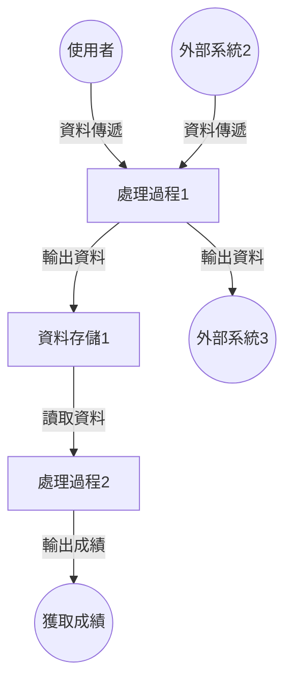

<h1>第六組</h1>

```mermaid
graph TD
    使用者((使用者)) -->|資料傳遞| 處理過程1[處理過程1]
    外部系統2((外部系統2)) -->|資料傳遞| 處理過程1
    處理過程1 -->|輸出資料| 資料存儲1[資料存儲1]
    處理過程1 -->|輸出資料| 外部系統3((外部系統3))
    資料存儲1 -->|讀取資料| 處理過程2[處理過程2]
    處理過程2 -->|輸出成績| 獲取成績((獲取成績))

```
