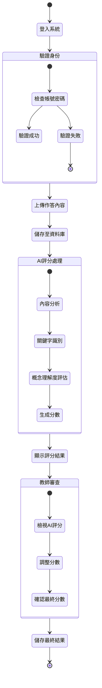

```mermaid
stateDiagram-v2
    [*] --> 登入系統
    登入系統 --> 驗證身份
    
    state 驗證身份 {
        [*] --> 檢查帳號密碼
        檢查帳號密碼 --> 驗證成功
        檢查帳號密碼 --> 驗證失敗
        驗證失敗 --> [*]
    }
    
    驗證身份 --> 上傳作答內容
    上傳作答內容 --> 儲存至資料庫
    儲存至資料庫 --> AI評分處理
    
    state AI評分處理 {
        [*] --> 內容分析
        內容分析 --> 關鍵字識別
        關鍵字識別 --> 概念理解度評估
        概念理解度評估 --> 生成分數
    }
    
    AI評分處理 --> 顯示評分結果
    顯示評分結果 --> 教師審查
    
    state 教師審查 {
        [*] --> 檢視AI評分
        檢視AI評分 --> 調整分數
        調整分數 --> 確認最終分數
    }
    
    教師審查 --> 儲存最終結果
    儲存最終結果 --> [*]
```